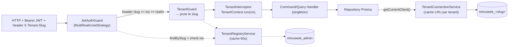

# Guide d'implémentation multi-tenant

> Compagnon d'[ADR-0001 — Multi-tenant : une base de données par tenant](adr/0001-multi-tenant-db-per-tenant.md).
> L'ADR fixe **la décision** (une DB PostgreSQL par tenant + une base système partagée). Ce document dit **comment la construire** dans le code : découpage Prisma admin/tenant, services, résolution du tenant à la requête, provisioning, migrations.

## 1. Vue d'ensemble : deux plans

Le système se sépare en deux plans qui ne partagent aucune donnée métier.

| Plan | Base | Contenu | Client Prisma | Realm IdP |
|------|------|---------|---------------|-----------|
| **Control-plane** (système) | `minuseek_admin` (unique) | registre des tenants | `AdminPrismaService` (singleton) | `minuseek-system` (SUPERADMIN) |
| **Data-plane** (métier) | `minuseek_<slug>` (une par tenant) | affaires, traces, empreintes, calques | `TenantConnectionService` (cache de clients) | `minuseek-<slug>` (un par tenant) |

Le control-plane est le **seul** connu au démarrage. Tout le reste est résolu dynamiquement à partir de la requête, à chaque appel.



## 2. Découpage Prisma : deux schémas, deux clients générés

Deux arborescences Prisma **indépendantes**, chacune avec sa config et son client généré. Le schéma métier existant **ne bouge pas** — c'est le point qui garde le diff raisonnable.

```
app/
  prisma/                        # métier (EXISTANT, inchangé)
    schema.prisma                #   generator output = ../generated/prisma
    models/*.prisma              #   InvestigationCase, Trace, ReferencePrint, Layer
    migrations/                  #   les 3 migrations actuelles, rejouées telles quelles sur chaque DB tenant
  prisma-admin/                  # système (NOUVEAU)
    schema.prisma                #   generator output = ../generated/prisma-admin
    migrations/                  #   registre des tenants
  prisma.config.ts               # config métier (existante)
  prisma-admin.config.ts         # config système (nouvelle)
  generated/
    prisma/                      # client métier (1 seul client, réutilisé pour les N DB tenant)
    prisma-admin/                # client système
```

Points clés :
- **Un seul client métier généré**, réutilisé pour toutes les bases tenant (même schéma partout). Surtout **ne pas** générer N clients.
- Les imports actuels des repos/readers (`../../generated/prisma/client`) **restent valides**.
- La contrainte `@unique` sur `caseNumber` devient naturellement **par tenant** (une base = un espace de noms). C'est la sémantique voulue.
- Scripts `package.json` :
  ```jsonc
  "prisma:generate-admin":  "prisma generate --schema=prisma-admin/schema.prisma --config=prisma-admin.config.ts",
  "prisma:generate-tenant": "prisma generate --schema=prisma       --config=prisma.config.ts"
  ```

### Modèle du registre (control-plane)

Le registre est un **annuaire** : une ligne = un tenant prêt. Pas d'état de provisioning en base (l'orchestration vit dans le code, voir §7).

```prisma
// prisma-admin/schema.prisma
model Tenant {
  id                    String   @id @default(uuid()) @db.Uuid
  slug                  String   @unique                                      // laboratoire-1
  displayName           String   @map("display_name")
  databaseName          String   @unique @map("database_name")                // minuseek_laboratoire_1
  identityProviderRealm String   @unique @map("identity_provider_realm")      // minuseek-laboratoire-1
  createdAt             DateTime @default(now()) @map("created_at")
  updatedAt             DateTime @updatedAt @map("updated_at")
  @@map("tenant")
}
```

**Convention de dérivation immuable** — zéro mapping externe, donc zéro divergence de config :

```
slug "laboratoire-1"  →  databaseName          "minuseek_laboratoire_1"   (slug avec '-' → '_')
                      →  identityProviderRealm "minuseek-laboratoire-1"
```

`databaseName` et `identityProviderRealm` sont **dérivés au provisioning** puis **stockés** dans le registre (source de vérité pour les lookups). Jamais de credentials en base : l'URL est reconstruite depuis un template d'env (§4).

## 3. Le service Prisma système : `AdminPrismaService`

Singleton classique — c'est l'actuel `PrismaService`, mais sur le client système et une petite pool. Ajouter `OnModuleDestroy` (que l'actuel `prisma.service.ts` oublie), sinon Jest e2e et SIGTERM Docker pendent.

```ts
// app/src/tenancy/infrastructure/persistence/admin-prisma.service.ts
const ADMIN_POOL_MAX = 4;

@Injectable()
export class AdminPrismaService extends PrismaClient
  implements OnModuleInit, OnModuleDestroy {
  constructor(config: ConfigService) {
    const pool = new Pool({
      connectionString: config.getOrThrow('ADMIN_DATABASE_URL'),
      max: ADMIN_POOL_MAX,
    });
    super({ adapter: new PrismaPg(pool) });
  }
  async onModuleInit()    { await this.$connect(); }
  async onModuleDestroy() { await this.$disconnect(); }
}
```

### `TenantRegistryService` — le registre en cache

Lit la table `Tenant` via `AdminPrismaService`, avec un cache TTL court pour éviter un aller-retour admin à chaque requête.

```ts
// app/src/tenancy/application/tenant-registry.service.ts
const REGISTRY_TTL_MS = 60_000;      // n'invalide pas un hit positif trop vite
const NEGATIVE_TTL_MS = 10_000;      // slug inconnu : cache court pour amortir les requêtes hostiles

findBySlug(slug: string): Promise<TenantRecord | null>  // strategy JWT (header) + TenantGuard
invalidate(slug: string): void                          // après provisioning et à la suppression
```

- **Ne jamais cacher un `null` longtemps** (negative TTL 10 s) : un nouveau tenant devient visible quasi immédiatement, et un slug inconnu ne coûte pas un `SELECT` par tentative.
- `invalidate()` est appelé après le provisioning (la ligne vient d'être créée) et à la suppression (pour qu'un token encore valide ne résolve plus un tenant supprimé).

## 4. Le service Prisma tenant : `TenantConnectionService`

C'est le cœur du data-plane. Il tient un **cache de `PrismaClient` par tenant** (un `Pool` pg par client via `@prisma/adapter-pg`) et expose deux accès :

```ts
// app/src/tenancy/infrastructure/persistence/tenant-connection.service.ts
getClient(slug: string): Promise<PrismaClient>   // EXPLICITE — chemins hors HTTP (jobs, provisioning, admin)
getCurrentClient():      Promise<PrismaClient>   // IMPLICITE — lit le slug dans l'AsyncLocalStorage (§5)
```

```ts
async getClient(slug: string): Promise<PrismaClient> {
  const cached = this.cache.get(slug);
  if (cached) { cached.lastUsedAt = this.clock.now(); return cached.client; }

  // single-flight : évite deux pools orphelins sur deux miss concurrents du même slug
  const inFlight = this.creating.get(slug);
  if (inFlight) return inFlight;

  const promise = this.create(slug);
  this.creating.set(slug, promise);
  try { return await promise; } finally { this.creating.delete(slug); }
}

private async create(slug: string): Promise<PrismaClient> {
  const record = await this.registry.findBySlug(slug);
  if (!record) throw new TenantUnavailableError(slug); // la ligne existe ⟺ le tenant est prêt

  const pool = new Pool({
    connectionString: this.buildUrl(record.databaseName),
    max: TENANT_POOL_MAX,                 // 3 (voir §12)
    idleTimeoutMillis: 10 * 60_000,       // purge les connexions inactives (sinon Postgres les coupe → "connection lost")
    application_name: `minuseek-${slug}`, // visibilité dans pg_stat_activity
  });
  const client = new PrismaClient({ adapter: new PrismaPg(pool) });
  await client.$connect();
  this.evictIfOverCap();                  // LRU + cap : borne la mémoire et le nombre de pools
  this.cache.set(slug, { client, pool, lastUsedAt: this.clock.now() });
  return client;
}

private buildUrl(databaseName: string): string {
  // template d'env, PAS de credentials en base : TENANT_DATABASE_URL_TEMPLATE = postgres://u:p@host:5432/{db}
  return this.template.replace('{db}', databaseName);
}

async getCurrentClient(): Promise<PrismaClient> {
  const slug = this.tenantContext.getCurrentTenant();
  if (!slug) throw new NoTenantInContextError(); // fail-closed : jamais de client "par défaut"
  return this.getClient(slug);
}
```

Cycle de vie complet (à ne pas oublier) :
- **`evict(slug)`** : `$disconnect()` + `pool.end()` + retrait du cache. Appelé **avant** `DROP DATABASE` (SUP-05) et à la bascule d'un restore (SUP-10).
- **`OnModuleDestroy`** : itère le cache, `$disconnect()` + `pool.end()` sur tout, vide la Map.
- **Éviction LRU** avant d'ajouter au-delà du cap ; ne pas évincer un client avec des requêtes en vol (compteur `inFlight`).

### Côté repositories

Les repos/readers échangent l'injection de `PrismaService` contre `TenantConnectionService` et appellent `getCurrentClient()` — **pas de slug dans les signatures** (le slug voyage dans l'AsyncLocalStorage, §5) :

```ts
// avant : constructor(private readonly prisma: PrismaService) {}
// après :
constructor(private readonly tenantConnection: TenantConnectionService) {}

async findById(id: string): Promise<Trace | null> {
  const prisma = await this.tenantConnection.getCurrentClient();
  const row = await prisma.trace.findUnique({ where: { id } });
  return row ? TraceMapper.toDomain(row) : null;
}
```

> **Variante à diff minimal** : garder une façade nommée `PrismaService` (même chemin d'import) qui délègue à `getCurrentClient()`, pour ne toucher aucun repo. Plus léger, mais plus « magique ». Recommandation : faire le changement explicite ci-dessus — il n'y a que quelques fichiers et ça se grep.

## 5. Résolution du tenant dans le code

Deux cas, à traiter différemment. On **n'utilise pas** les providers request-scoped ni durable de NestJS : un provider mal configuré y instancie un `PrismaClient` (donc un pool) par requête, sans erreur visible.

### Chaîne HTTP — AsyncLocalStorage

Le tenant voyage dans un contexte ambiant, posé en début de requête et lu au moment de l'accès DB. Trois pièces, toutes des singletons globaux :

```ts
// app/src/tenancy/tenant-context.service.ts
@Injectable()
export class TenantContextService {
  private static readonly storage = new AsyncLocalStorage<TenantContext>();
  run<T>(ctx: TenantContext, cb: () => T): T { return TenantContextService.storage.run(ctx, cb); }
  getCurrentTenant(): string | undefined     { return TenantContextService.storage.getStore()?.slug; }
}
```

1. **`TenantGuard`** (`APP_GUARD`, après `JwtAuthGuard`) : lit le slug validé par la strategy (§6) et le pose dans `request.tenantContext`. Token du realm système (sans header tenant) ⇒ **aucun** tenant posé (le SUPERADMIN ne peut atteindre aucune donnée métier — IA-12/IA-21).
2. **`TenantInterceptor`** (`APP_INTERCEPTOR`) : enveloppe tout le pipeline dans `tenantContext.run(ctx, () => next.handle())`. Les Observables RxJS préservent le contexte `async_hooks` automatiquement.
3. Les repositories lisent le client via `getCurrentClient()` — le slug est invisible dans les signatures.

> **Header `X-Tenant-Slug` + accord obligatoire avec `iss`.**
> Le client envoie le slug dans un header (plus direct que de le parser depuis l'URL de l'`iss`) — c'est une couche explicite. Mais le header seul ne prouve rien : la sécurité vient du fait que **header, `iss` et realm de signature doivent désigner le même tenant** (détail §6). C'est la règle « le tenant et l'issuer doivent être identiques ».

### Frontières asynchrones — tenant explicite

Partout où l'on **sort** de la pile d'appels HTTP, l'AsyncLocalStorage se vide. Il faut alors transporter le tenant explicitement, et on le **rend obligatoire par le type** pour avoir une garantie compilateur :

- **Events CQRS** — tout `DomainEvent` porte `tenantSlug`, capturé au `publish`. On force le champ via une classe de base :
  ```ts
  export abstract class TenantScopedEvent { protected constructor(public readonly tenantSlug: string) {} }
  // un event qui n'étend pas TenantScopedEvent ne PEUT PAS transporter le tenant → ne compile pas là où le handler en a besoin
  ```
  L'event handler relit `event.tenantSlug` et appelle `getClient(event.tenantSlug)` — **jamais** `getCurrentClient()`.
- **Jobs / seeders / CLI / provisioning** — ouvrir explicitement un contexte :
  ```ts
  await this.tenantContext.run({ slug }, async () => { /* le code appelé hérite du contexte */ });
  ```

> **Règle d'équipe à inscrire dans `AGENTS.md`** : hors requête HTTP, on ne lit jamais le tenant de l'AsyncLocalStorage — on le passe. `getCurrentClient()` est réservé aux repos appelés depuis un handler HTTP.

## 6. Auth multi-realm : `MultiRealmJwtStrategy`

Remplace l'actuelle `jwt.strategy.ts` (mono-realm). **Invariant** : le header `X-Tenant-Slug`, le claim `iss` et le realm qui valide la signature doivent désigner le **même** tenant, sinon rejet.

1. **Lire `X-Tenant-Slug`** → `registry.findBySlug(slug)`. Slug absent ou inconnu → `403`, **aucun** réseau. (Comme on ne résout qu'un tenant **enregistré**, on ne fetch jamais le JWKS d'un realm arbitraire → pas de SSRF.)
2. **Décoder `iss` sans vérifier** la signature (`jwt.decode`) → exiger `iss == record.issuer` (l'issuer attendu, dérivé de `identityProviderRealm`). Sinon → `401`. ← **la règle « tenant et issuer identiques »**
3. **Valider la signature contre le JWKS de CE realm** (`Map<realm, JwksClient>` en cache via `jwks-rsa`, `cache: true`, `rateLimit: true`) + `aud = minuseek-api` + `exp`. La signature est vérifiée contre le realm **réclamé** — c'est ce qui empêche un token du tenant A d'ouvrir la base du tenant B (*tenant confusion*).
4. **`validate()`** re-contrôle `iss == record.issuer` et pose `request.user` + `request.tenantContext = { slug }`. La base sera keyée sur ce slug, désormais **prouvé cohérent** avec le token signé.

Le realm système (`minuseek-system`) : token **sans** header tenant, `iss == issuer système` → `isSystemRealm = true`, aucun `tenantSlug`. Les endpoints `/superadmin` exigent ce flag ; les endpoints métier l'interdisent.

Variables d'env :
```
KEYCLOAK_INTERNAL_URL   # fetch JWKS (nom de service Docker)
KEYCLOAK_PUBLIC_URL     # issuer tel qu'il apparaît dans le claim iss
KEYCLOAK_SYSTEM_REALM   # minuseek-system
KEYCLOAK_AUDIENCE       # minuseek-api (mapper d'audience identique sur tous les realms)
```

## 7. Provisioning d'un tenant (SUP-03)

Trois systèmes (Postgres admin, Prisma migrate, IdP Keycloak) ⇒ **pas de transaction distribuée possible**. On orchestre dans le code (le handler), en étapes séquentielles, chacune **idempotente** (check-exists avant create). **La ligne du registre est écrite en dernier** : tant qu'elle n'existe pas, le tenant n'est pas résolu (la strategy renvoie `403`) ; son existence = provisioning réussi.

`POST /superadmin/tenants { slug, adminEmail }` → `ProvisionTenantHandler` :

| # | Étape | Idempotence | Compensation si échec |
|---|-------|-------------|-----------------------|
| 1 | valider le slug (`^[a-z0-9-]+$`), dériver `databaseName` + realm | — | — |
| 2 | créer le realm `minuseek-<slug>` (+ rôles, client, mapper audience) | `findOne` avant `create` | supprimer le realm |
| 3 | `CREATE DATABASE minuseek_<slug>` | `SELECT FROM pg_database` avant | `DROP DATABASE` |
| 4 | fan-out migrations sur la nouvelle base (`prisma migrate deploy`) | `migrate deploy` est idempotent | (couvert par le drop) |
| 5 | créer le premier ADMIN dans le realm | — | — |
| 6 | **`INSERT Tenant`** (en dernier) + `registry.invalidate(slug)` | unicité du slug (`409` si existe) | — |

- **Échec en cours de route** : aucune ligne de registre n'est créée. La saga (dans le handler) compense en ordre inverse (drop DB, delete realm). Un simple retry rejoue les étapes — toutes idempotentes — sans doublon. Rien à persister en base : le registre ne connaît que les tenants prêts.
- **Realm Keycloak** : créé depuis un template TS calqué sur `keycloak/dev/minuseek-demo-realm.json`. Attention au **délai** : le realm n'est pas accessible immédiatement après création — ré-authentifier avant de le configurer.
- **Validation du nom de base** : `databaseName` doit matcher `^[a-z0-9_]+$` avant tout `CREATE DATABASE` (les identifiants SQL ne sont pas paramétrables) — barrière anti-injection.

## 8. Suppression (SUP-05) et backup/restore (SUP-09/10)

**Suppression** `DELETE /superadmin/tenants/:slug` :

```sql
SELECT pg_terminate_backend(pid) FROM pg_stat_activity
  WHERE datname = $1 AND pid <> pg_backend_pid();
DROP DATABASE IF EXISTS "minuseek_<slug>";
```

Ordre : `pg_dump` de sûreté → `connection.evict(slug)` → suppression du realm IdP → terminaison des backends + `DROP DATABASE` → suppression de la ligne du registre + `registry.invalidate(slug)`. Le crypto-shred est trivial : plus de base = données irrécupérables.

**Restore (SUP-10) en blue/green** : `pg_restore` dans une base **neuve** `minuseek_<slug>_r<timestamp>`, puis bascule de `databaseName` dans le registre + `evict(slug)`. On **n'écrase jamais** la base courante → rollback trivial si le dump est mauvais.

## 9. Fan-out des migrations

Un seul schéma métier, N applications. Script `scripts/migrate-all.sh` :

1. `prisma migrate deploy` sur `minuseek_admin` (le registre doit exister avant de lister les tenants).
2. **Découverte dynamique** des bases via `pg_database` — pas de liste codée en dur :
   ```sql
   SELECT datname FROM pg_database
   WHERE datistemplate = false AND datname LIKE 'minuseek\_%' AND datname <> 'minuseek_admin'
   ORDER BY datname;
   ```
3. Boucle **séquentielle** : pour chaque base, `DATABASE_URL=... prisma migrate deploy --schema=prisma/schema.prisma`.

- **Échec partiel** : ne pas s'arrêter à la première erreur en aveugle. **Continuer puis rapporter OK/KO** en fin de course (le déploiement reste bloqué tant que tout n'est pas au niveau), avec un flag `--report` qui affiche l'état `_prisma_migrations` de chaque base (détection de drift).
- **Déploiement** : découpler build et run — un target Docker `migration` dédié, lancé comme job manuel (Cloud Run Job / CI), **pas** dans le `CMD` de l'app (sinon un tenant KO empêche tout le parc de démarrer, et course multi-replica sur `_prisma_migrations`).

## 10. Dev local

- **Postgres multi-DB** : init SQL au démarrage du conteneur qui crée `minuseek_admin` + `minuseek_demo` + `minuseek_demo2`.
- **Deux realms de démo** : `minuseek-demo` et `minuseek-demo2` importés, pour **tester l'isolation** pour de vrai.
- **Test e2e d'isolation croisée** (le test qui justifie tout le chantier) : deux tokens de `demo` et `demo2`, on asserte qu'aucune donnée ne traverse et que deux requêtes du même tenant réutilisent le même client.
- **Rituel** : provisionner un `demo3` via la **vraie** API superadmin dans le dev loop — SUP-03 est testé en permanence au lieu d'être un chemin froid qui casse le jour J.
- **Garde-fou CI** : règle ESLint `no-restricted-imports` interdisant `generated/prisma-admin` hors du module control-plane (IA-21, gratuit et vérifiable).

## 11. Structure des modules cible

```
app/src/
  tenancy/                       # machinerie technique multi-tenant (le seul module qui connaît le multi-DB)
    tenant-context.service.ts
    infrastructure/http/         { tenant.guard.ts, tenant.interceptor.ts }
    infrastructure/persistence/  { admin-prisma.service.ts, tenant-connection.service.ts, tenant-database-admin.service.ts }
    infrastructure/keycloak/     { keycloak-admin.service.ts }
    application/                 { tenant-registry.service.ts }
  superadmin/                    # bounded context control-plane
    application/commands/        { provision-tenant, delete-tenant, backup-tenant, restore-tenant }
    infrastructure/http/         { superadmin.controller.ts, superadmin.guard.ts }
  auth/                          # MultiRealmJwtStrategy (réécrite), guards existants
  investigation/ biometrics/     # inchangés sauf : injection TenantConnectionService dans les repos
```

## 12. Budget de connexions

Formule : `N_tenants × TENANT_POOL_MAX + ADMIN_POOL_MAX + pools_provisioning < max_connections`.

| Paramètre | Valeur | Note |
|-----------|--------|------|
| `TENANT_POOL_MAX` | **3** | suffit à l'échelle POC et laisse de la marge |
| `ADMIN_POOL_MAX` | 4 | pool du control-plane |
| cap du cache de clients | ~20 | LRU au-delà : borne mémoire + pools |
| pools éphémères (create/drop DB) | `max: 2`, sérialisés | éviter de saturer en création concurrente |
| `max_connections` serveur | 100 (dev) / à dimensionner (prod) | au-delà de ~100 tenants : PgBouncer (déjà noté dans l'ADR) |

Exemple : 20 tenants actifs × 3 + 4 + 2 = **66 < 100**. ✅

## 13. Correspondance avec les tickets de l'ADR

| Ticket ADR | Sections de ce guide |
|------------|----------------------|
| 0. (préalable) activer `JwtAuthGuard` global | §6 |
| 1. Base système + registre | §2, §3 |
| 2. `PrismaService` multi-tenant (fabrique + cache + contexte) | §4, §5 |
| 3. `JwtStrategy` multi-realm + garde tenant | §5, §6 |
| 4. Provisioning SUP-03 | §7 |
| 5. Fan-out des migrations | §9 |
| 6. Docker dev multi-DB + 2ᵉ realm | §10 |
